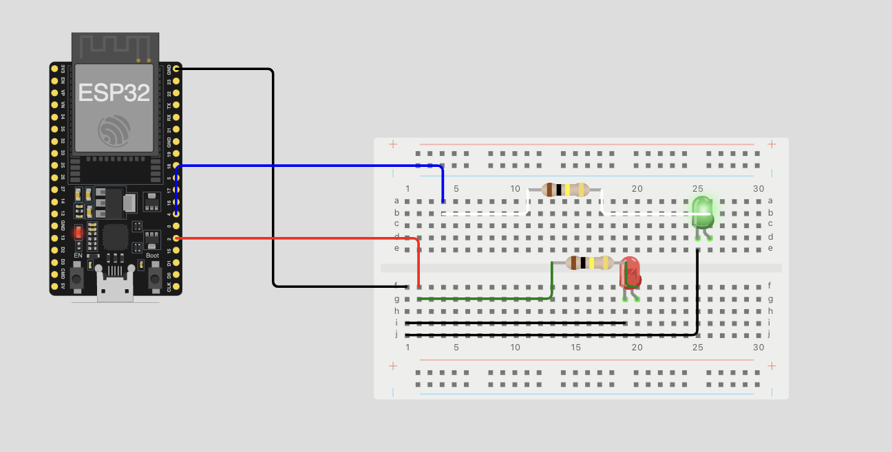

# LED_ESP32

## Overview

This repository contains a simple project designed to blink an LED using an ESP32 development board. It is configured using the PlatformIO IDE and utilizes the Arduino framework. This project serves as a basic example and a learning tool for those who want to get started with ESP32 development and the Wokwi simulator.

**Important Note:** This is a small, hobby project created for educational purposes. It's primarily intended to explore the capabilities of the Wokwi Simulator and to provide a starting point for learning about embedded systems and IoT development with the ESP32.

## Features

- Basic ESP32 configuration with PlatformIO
- Arduino framework examples
- LED blinking test

## Prerequisites

- [Visual Studio Code](https://code.visualstudio.com/)
- [PlatformIO IDE](https://platformio.org/install/ide?install=vscode)
- ESP32 development board
- USB cable for programming
- Basic knowledge of C++ programming
